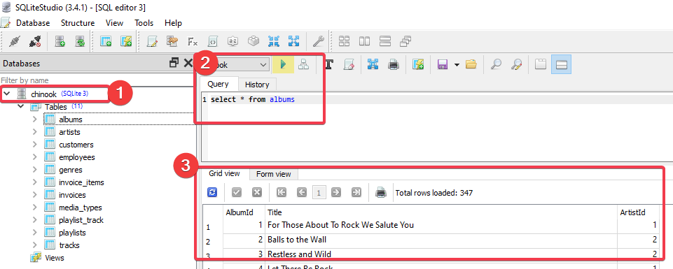

Content
================

- <a href="#software-requirements-on-your-computer"
  id="toc-software-requirements-on-your-computer">Software requirements on
  your computer</a>
- <a href="#reference-materials" id="toc-reference-materials">Reference
  Materials</a>
- <a href="#r-and-rstudio-installation"
  id="toc-r-and-rstudio-installation">R and RStudio (installation)</a>
- <a href="#sqlitestudio-installation"
  id="toc-sqlitestudio-installation">SQLiteStudio (installation)</a>
- <a href="#practical-test-tips" id="toc-practical-test-tips">Practical
  test tips</a>

## Software requirements on your computer

Please install and familiarize with the software below.

- R
- RStudio
- SQLiteStudio
- Excel
- Word

## Reference Materials

The concept covered in this test can be found in the following
reference.

| Skills | Reference                                               | Details                                                     |
|--------|---------------------------------------------------------|-------------------------------------------------------------|
| R      | [R for Data Science](https://r4ds.had.co.nz/index.html) | Chapter 1 - 21 only                                         |
| SQL    | [W3Schools](https://www.w3schools.com/sql/default.asp)  | SQL Tutorial section only (not SQL Database and References) |
| Excel  | [W3Schools](https://www.w3schools.com/excel/index.php)  | All                                                         |

## R and RStudio (installation)

- Install R from here: <https://cran.r-project.org/mirrors.html>
- Install RStudio from here:
  <https://posit.co/download/rstudio-desktop/>
- Install these packages: tidyverse, lubridate, and any other
  analysis-related packages.

## SQLiteStudio (installation)

- Install SQLiteStudio: <https://sqlitestudio.pl/>
- Download a sample database for testing here:
  [download](assets/chinook.db)
- Open SQLiteStudio, and try if you can input the sample database:
  1.  Click Database (top left) \> Add a database

  2.  At “File”, click the folder icon and choose the `chinook.db` you
      have downloaded. \> Select \> OK

  3.  If you succeed in adding the database, you will see the database
      (item 1 shown below). Click the database name to see the table
      inside it.

      

  4.  Enter SQL statement in Query window (step 2), and click run button
      to see the output (Item 3).
- In the real test, we will provide another database to test your
  understanding in SQL statement.

## Practical test tips

- **You will receive a practical test email from us at your selected
  time slot.** Unzip the attachment. Start with the document
  `00_Assessment Test.docx`. This file contains all the instructions.

- **Keep an eye on the time - it’ll fly by.** In the instruction
  document, we provided the distribution of marks for each section, so
  that you can keep track of time spent in each section. Email back to
  us within 2 hours, with all your work including R and SQL scripts.

- **Do not worry that you may not get the right answer.** It’s more
  important to show your logical thinking through the working steps. For
  example, if 10 marks are assigned to a question, the steps themselves
  may get you 9 marks, and the right answer alone may just earn you 1
  mark.

- You can choose to **take the test in our non-office hours** (weekend
  or stat holiday), but we are out of the office at that time, so we
  could only respond to your email in the next business day. If you
  don’t receive the test during the weekend, please contact HR Team
  (jgregory@gatewaycasinos.com) and we may be able to re-arrange it
  accordingly.
